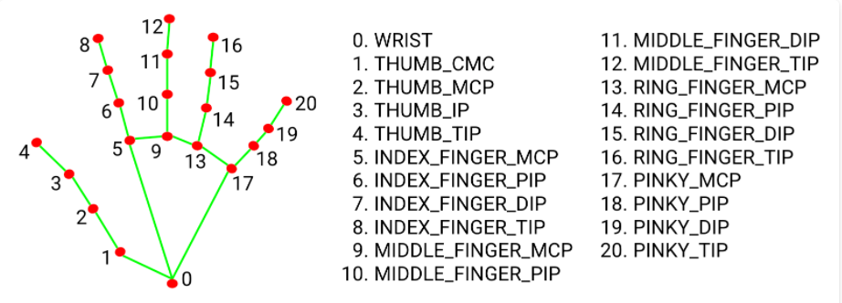
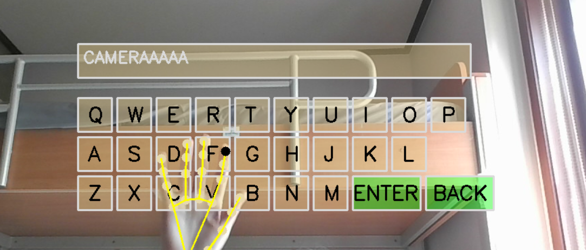

# Virtual Han-Tracking Keyboard
## 📌 Intro
This project demonstrates how to build a virtual Keyboard using mediapipe and OpenCV. By tracking hand landmarks, the system allows users to "press" keys on a virtual keyboard with index finger. The main idea of this project is launching applications directly from the virtual keyboard.

## 🧩 Basic Knowledge: Hand Tracking
Hand tracking is a computer vision technique that detects and follows the position of hand in real time. Mediapipe identifies 21 key points on the hand. 

But there is one important update.
>Mediapipe API Update

In older versions of mediapipe, developers used to **solution module** for hand tracking. However, mediapipe uses the Tasks API **mediapipe.tasks.python.vision** for hand landmark detection.

```python
from mediapipe.tasks import python
from mediapipe.tasks. python import vision
...

base_options = python.BaseOptions(model_asset_path = "hand_landmarker.task")
options = vision.HandLandmarkerOptions(base_options = base_options, num_hands=2)
detector = vision.HandLandmarker.create_from_options(options)
```
## 🔗Design of keybaord
The keyboard design uses a transparent color scheme to create a modern and visually appealing look.



